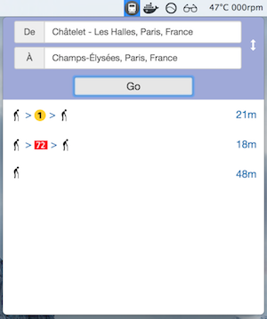

# TakeMeHome

Electron [`MenuBar`](https://github.com/maxogden/menubar) application that allow you to find your way to home where ever
you are.

Works on Mac OS, Windows and some Linuxes.


## APIs

This app use the [`Navitia`](https://www.navitia.io) API. Please create an account and get a token.

Then update the code or set the env with :

```
export NAVITIA_TOKEN=<your_token>
```


## Mode developer

```
npm install
npm start
```

## Utilisation

Just build the app like a normal [`Electron`](http://electron.atom.io) app and launch it.
